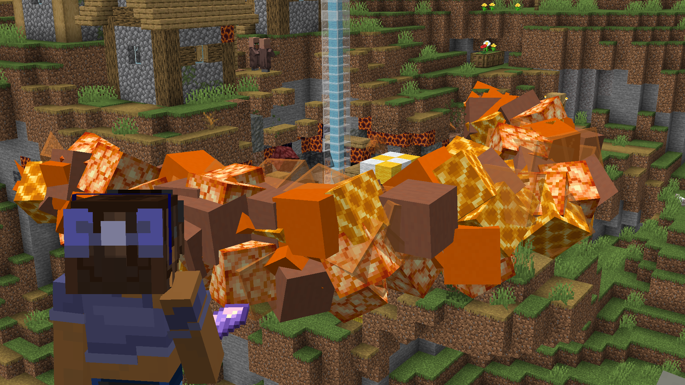

# Ra's Rays

This is a server side mod that adds orbital strike cannons to the game
with the use of block display entities and polymer.

> This mod is heavily inspired by Cymaera's SkyTorch and wouldn't of existed
without him, link to his video about it [here](https://www.youtube.com/watch?v=OKXTGbp6AMk)


> A video about my mod coming soon join my [discord](https://discord.gg/W49Mf7nbuK) for more info

## Installation
1. Download the JAR from the [releases page](https://github.com/TheCymaera/minecraft-sky-torch/releases/).
2. Set up a [Fabric](https://fabricmc.net/use/server/) server. (Instructions below)
3. Add the JAR to the `mods` folder.
4. Start your server with the instructions on the fabric page
5. Join the server with `localhost` as the IP address.

## Commands
Autocomplete will show available options.
```
# Get the items
/polymer creative

# or use /give
/give rarays:ra_ray_spawner
```

## Development
1. Clone or download the repo.
2. Run gradlew `build` to build the plugin. The resulting JAR will be in the `build/libs` folder. (make sure to take the one without the sources in its name)
3. Make your modifications
4. Create a pr on my repo if you want to contribute

## Bugs or support
For support you can join my discord: https://discord.gg/W49Mf7nbuK

## License
Copyright IDoTheHax (c) 2024
All rights reserved.
